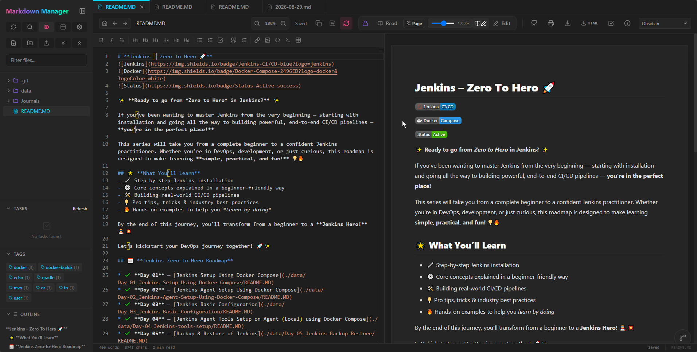
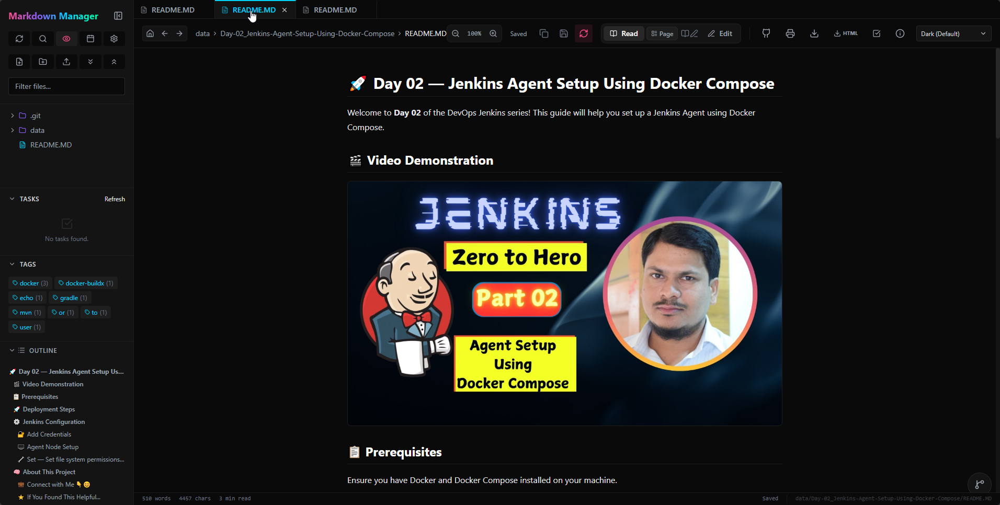
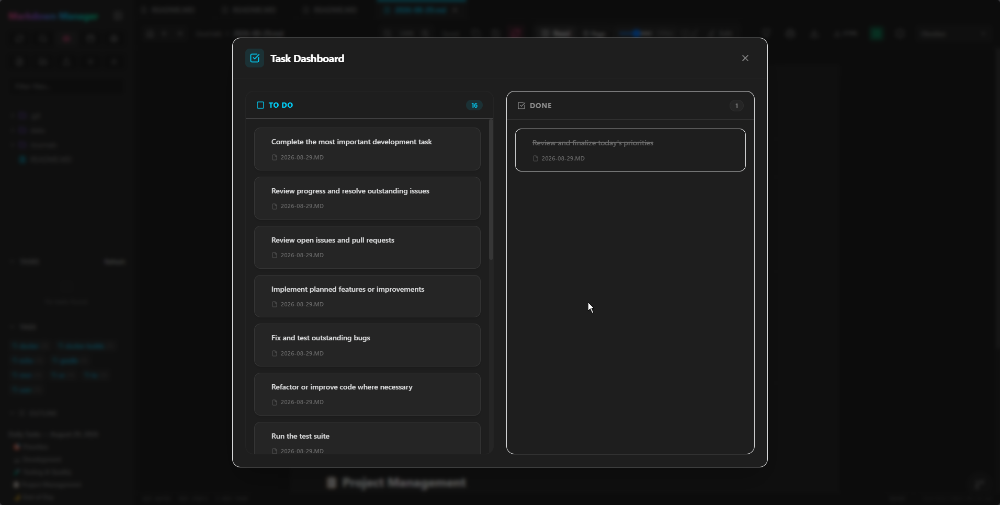
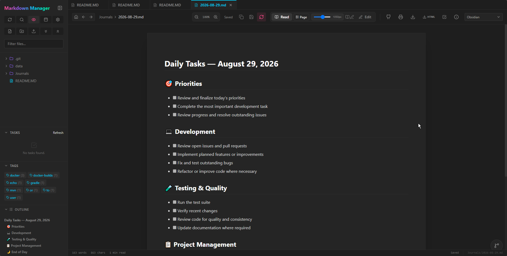
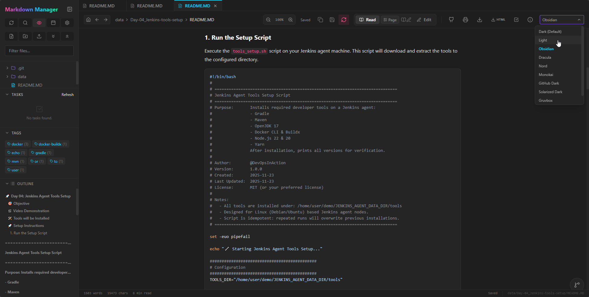
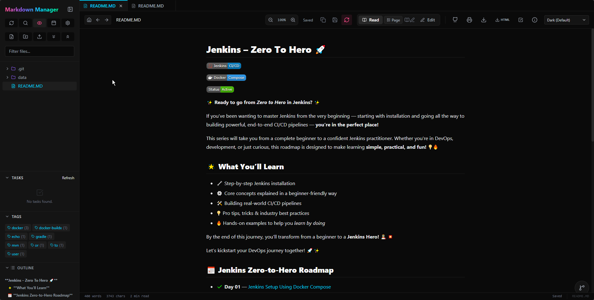

# 📝 Markdown Manager

<div align="center">
 
**A production-quality, deeply integrated, locally-hosted Markdown Knowledge Base and Editor**  
_Your files, your data. Beautiful Obsidian-like features, entirely offline._

[](https://github.com/meibraransari/markdown-manager)

</div>

---

## 📸 Screenshots

| | | |
|---|---|---|
|  |  |  |
|  |  |  |

---

## 🚀 Quick Start

Get **Markdown Manager** running locally in just a few commands:

```bash
# 1. Clone the repo
git clone https://github.com/meibraransari/markdown-manager.git
cd markdown-manager

# 2. Start all services
docker compose up --build -d
```

Once running, open your browser and navigate to **`http://localhost:8000`** to access the application.

---

## 🐳 Docker Setup

### Local Commands

```bash
# Start all services in background
docker compose up -d

# View logs
docker compose logs -f

# Stop everything
docker compose down

# Rebuild after code changes
docker compose up -d --build
```

### Mounting a Directory

By default, Markdown Manager operates on a mounted directory. In `docker-compose.yml`, modify the volume mount to point to your local markdown documents folder:

```yaml
volumes:
  - ./my-documents:/workspace
```

---

## 📚 Features Guide

For a comprehensive overview of the available features and capabilities, please refer to the [features.md](features.md) document. 

Key features include:
* 🔄 **Dual Modes**: Edit mode with Monaco Editor and live Read mode.
* 📸 **Clipboard Image Paste**: Direct pasting of images into Markdown.
* ⌨️ **Vim Keybindings**: Full keyboard-centric editor support.
* 🕸️ **Interactive Graph View**: Visual mapping of wikilinks and connections.
* 📋 **Global Task Manager**: Drag-and-drop Kanban dashboard linked to notes.
* 🎭 **10+ Pro Themes**: One-click styling including Dracula, Nord, Obsidian.

---

## ⚙️ Environment Variables

Customize the application's runtime configuration using the following environment variables:

| Variable | Default | Required | Description |
|---|---|---|---|
| `MARKDOWN_ROOT` | `/workspace` | No | Absolute or relative path to the directory serving as the root |
| `PORT` | `8000` | No | External listening port for the application |
| `LOG_LEVEL` | `info` | No | Application logging level (`info`, `debug`) |

---

## 🛠️ Manual Development Setup

If you prefer to run the backend and frontend separately for development, follow these setup guides:

### 1. Backend Setup

The backend is built with FastAPI.
```bash
cd backend
pip install -r requirements.txt
uvicorn app.main:app --reload
```

### 2. Frontend Setup

The frontend is built with React and Vite.
```bash
cd frontend
npm install
npm run dev
```

---

## 🤝 Contributing

Contributions are welcome! Please follow these steps:
1. Fork the Repository.
2. Create your Feature Branch (`git checkout -b feature/AmazingFeature`).
3. Commit your Changes (`git commit -m 'Add some AmazingFeature'`).
4. Push to the Branch (`git push origin feature/AmazingFeature`).
5. Open a Pull Request.

---

## 📄 License

This project is licensed under the MIT License.
