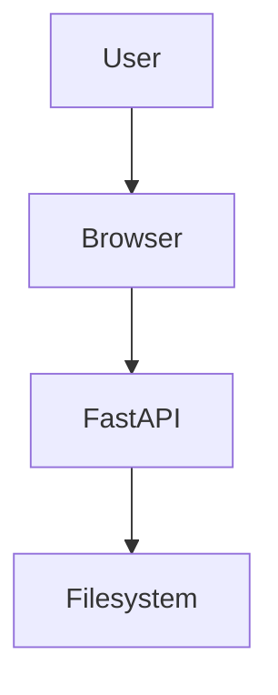

# Prompt: Build a Complete Web-Based Markdown File Manager for Gemini

You are an expert **Python backend engineer, full-stack web developer, UI/UX designer, Docker engineer, Markdown parser/editor developer, and software architect**.

Build a **complete, production-quality web application** that acts as a browser-based Markdown/documentation manager. The application must run locally or inside Docker Compose and must be able to browse, read, edit, preview, render, and save files from a configurable **mounted filesystem directory**.

The application should feel like a polished combination of:

* GitHub Markdown
* GitLab Markdown
* VS Code Markdown editing
* Microsoft Word-style document editing
* Notion-style document navigation
* Mermaid diagram rendering
* A modern documentation/wiki browser

The application must be designed as a real, maintainable application—not as a prototype or proof of concept.

---

## 1. Core Objective

Create a web application where the user can provide/mount a directory such as:

```text
/workspace
```

The application must recursively read the directory and display its folders and files through a web-based file explorer.

The user should be able to:

1. Browse folders.
2. Open Markdown files.
3. Read Markdown documents in a beautiful rendered view.
4. Toggle into Edit mode.
5. Edit Markdown using a rich, Word-like editing experience.
6. Toggle back into Read mode.
7. Save changes directly to the mounted filesystem.
8. Create new Markdown files.
9. Create folders.
10. Rename files/folders.
11. Delete files/folders with confirmation.
12. Move files/folders where practical.
13. Search files.
14. Navigate between linked Markdown files.
15. Render images, tables, code blocks, diagrams, links, headings, lists, etc.
16. Open documents referenced by relative links.
17. Preserve the actual Markdown source on disk.
18. Work entirely through the browser.

The application must **never require importing the Markdown files into a database just to edit them**. The mounted filesystem is the source of truth.

---

# 2. Technology Requirements

Use Python for the server/backend.

Prefer:

### Backend

* Python 3.12+
* FastAPI
* Uvicorn
* Pydantic
* Python-based Markdown parsing/rendering libraries where appropriate
* WebSocket or Server-Sent Events where useful
* Proper asynchronous filesystem operations where appropriate

### Frontend

Use a modern frontend architecture.

Preferred:

* React
* TypeScript
* Vite
* Tailwind CSS or another modern component/styling system

The frontend should communicate with the Python API.

If a different frontend technology is selected, explain why, but the final result must still provide the same functionality.

---

# 3. Docker Support

The application MUST support Docker Compose.

Provide:

```text
Dockerfile
docker-compose.yml
.dockerignore
.env.example
```

Example intended usage:

```yaml
services:
  markdown-manager:
    build: .
    ports:
      - "8000:8000"
    volumes:
      - ./workspace:/workspace
    environment:
      MARKDOWN_ROOT: /workspace
```

The application should work with:

```bash
docker compose up --build
```

Then the user should be able to open:

```text
http://localhost:8000
```

The exact port may be configurable through an environment variable.

---

# 4. Mounted Directory

The mounted directory is extremely important.

The application must treat:

```text
MARKDOWN_ROOT=/workspace
```

as its filesystem root.

The backend must recursively inspect this directory.

For example:

```text
/workspace
├── README.md
├── documentation
│   ├── introduction.md
│   ├── installation.md
│   └── architecture.md
├── guides
│   ├── python.md
│   └── docker.md
├── diagrams
│   └── architecture.md
└── images
    ├── logo.png
    └── architecture.svg
```

The browser should expose this hierarchy through a file explorer.

The application MUST prevent path traversal.

Requests such as:

```text
../../etc/passwd
```

must never be allowed.

Every filesystem operation must resolve the requested path and verify that it remains inside the configured root directory.

---

# 5. File Explorer

Create a beautiful left-side file explorer.

It should support:

* Folder tree
* Expand/collapse folders
* File icons
* Markdown icons
* Image icons
* Code/file icons
* Search/filter
* New file
* New folder
* Rename
* Delete
* Refresh
* Sort
* Context menu
* Keyboard navigation

Example:

```text
┌──────────────────────────────────────────────────────────────┐
│ Markdown Manager                                             │
├───────────────┬──────────────────────────────────────────────┤
│ FILES         │ document.md                                  │
│               │                                              │
│ 📁 docs       │ [Read] [Edit]                                │
│   📄 intro.md │                                              │
│   📄 guide.md │     Document title                           │
│               │     ───────────────                           │
│ 📁 images     │                                              │
│   🖼 logo.png │     Markdown content...                      │
│               │                                              │
│ 📄 README.md  │                                              │
└───────────────┴──────────────────────────────────────────────┘
```

---

# 6. Two Main Modes

The application MUST have exactly two primary document modes:

## READ MODE

Default mode.

The document is rendered as a beautiful, highly readable webpage.

Users cannot accidentally modify the document.

Show:

```text
[ READ ] [ EDIT ]
```

with the current mode visually highlighted.

## EDIT MODE

Clicking the Edit toggle switches the document into editing mode.

For example:

```text
[ READ ] [ EDIT ● ]
```

The editor must allow the user to modify the document.

Clicking Read returns to rendered Markdown.

---

# 7. Word-Like Editing Experience

The editor should feel substantially closer to **Microsoft Word / Google Docs** than a plain `<textarea>`.

Provide a rich toolbar.

At minimum support:

### Text

* Bold
* Italic
* Underline
* Strikethrough
* Inline code
* Highlight
* Superscript
* Subscript

### Paragraphs

* Paragraph
* H1
* H2
* H3
* H4
* H5
* H6
* Blockquote
* Code block

### Lists

* Ordered list
* Unordered list
* Nested lists
* Task/check lists

### Alignment

* Left
* Center
* Right
* Justify

### Links

* Insert link
* Edit link
* Remove link
* Link to local file
* Link to heading/anchor

### Images

* Insert image
* Image from local mounted directory
* Image URL
* Alt text
* Image title
* Image resizing where possible
* Image alignment

### Tables

Provide a visual table editor supporting:

* Insert table
* Add row
* Delete row
* Add column
* Delete column
* Cell editing
* Header rows
* Alignment
* Markdown table serialization

### Other

* Horizontal rule
* Footnotes
* Escape/undo
* Undo
* Redo
* Find
* Replace
* Select all

---

# 8. Markdown Compatibility

The application must support modern Markdown comprehensively.

Support standard Markdown:

```markdown
# Heading

## Heading 2

**bold**

*italic*

~~strikethrough~~

`inline code`

> blockquote

- list
- list

1. numbered
2. list

[link](file.md)


---

| Name | Value |
|------|-------|
| A    | B     |
```

Support GitHub-Flavored Markdown features wherever technically possible.

Support:

* GFM
* Tables
* Task lists
* Autolinks
* Strikethrough
* Fenced code blocks
* Syntax highlighting
* Heading anchors
* Emoji
* Footnotes
* HTML where safe
* Definition-style constructs where supported
* Nested lists
* Escaped Markdown
* Inline HTML where appropriate

Do not invent a proprietary Markdown format.

The saved file must remain normal Markdown.

---

# 9. GitHub/GitLab-Style Markdown

Aim for compatibility with Markdown commonly used by:

* GitHub
* GitLab
* CommonMark
* GFM-compatible Markdown editors

Documents should render as closely as reasonably possible to modern GitHub/GitLab documentation.

Include:

* Heading IDs
* Code highlighting
* Tables
* Task lists
* Alerts/admonitions where supported
* Details/summary blocks where possible
* Links
* Images
* HTML blocks
* Footnotes
* Emoji

For features that are not universally standardized, implement a clean, documented compatibility layer.

---

# 10. Mermaid Diagrams

This is mandatory.

Support Mermaid diagrams inside Markdown.

Example:

````markdown

````

Render Mermaid diagrams in Read mode.

In Edit mode, provide a good editing experience for Mermaid blocks.

Support common Mermaid diagram types, including:

* Flowchart
* Sequence diagram
* Class diagram
* State diagram
* Entity relationship diagram
* User journey
* Gantt
* Pie
* Git graph
* Mindmap
* Timeline
* Quadrant chart
* Architecture diagrams where supported by the installed Mermaid version

The Mermaid version must be configurable/upgradable.

Handle Mermaid rendering errors gracefully.

Do not let malformed Mermaid crash the page.

Display a useful error message near the diagram.

---

# 11. Other Diagram Formats

Architect the renderer so additional diagram syntaxes can be supported.

Where practical, support:

* Mermaid
* PlantUML
* Graphviz/DOT
* ASCII diagrams
* Code-based diagrams supported by safe browser-side renderers

Do not execute arbitrary shell commands from Markdown.

Any server-side diagram rendering must be sandboxed or otherwise designed safely.

---

# 12. Local File Linking

This is a critical requirement.

If:

```text
docs/a.md
```

contains:

```markdown
[Architecture](../architecture/system.md)
```

clicking the link in Read mode must open:

```text
architecture/system.md
```

inside the application.

Do NOT force the browser to download the file.

Likewise:

```markdown
[README](../README.md)
```

should open the corresponding Markdown document in the application.

Support:

* Relative links
* Absolute paths within mounted root
* URL fragments
* Heading anchors
* Relative images
* Nested folders
* Spaces in filenames
* URL encoded filenames

For example:

```markdown
[Installation](./guides/installation.md)
```

should work.

---

# 13. Markdown Link Resolution

Implement a dedicated link resolver.

For every Markdown link:

1. Determine whether it is external or local.
2. If external:

   * Open normally.
3. If local:

   * Resolve relative to the current Markdown file.
4. Normalize the path.
5. Verify it is inside the mounted root.
6. Open it inside the application.

Never allow:

```text
../../
```

to escape the root.

External URLs such as:

```text
https://example.com
```

must remain external.

---

# 14. Local Images

Markdown such as:

```markdown

```

must work.

The server should provide a safe mechanism for serving files from the mounted root.

Support common image formats:

* PNG
* JPEG
* JPG
* GIF
* SVG
* WebP
* AVIF where supported

Validate paths before serving files.

---

# 15. Document Navigation

Provide:

* Breadcrumbs
* Previous/next document where useful
* Back/forward navigation
* Recent files
* Open document tabs if practical
* Table of contents

For a document such as:

```markdown
# Introduction

## Installation

## Configuration

### Environment Variables

## Deployment
```

automatically generate a document outline.

Display it in a right-side panel or floating navigation.

Clicking a heading should scroll to that heading.

---

# 16. Search

Implement filesystem/document search.

Search should be able to find:

* Filename
* Folder
* Markdown content

Example:

```text
Search documentation...
```

Results:

```text
architecture/system.md
  line 42: FastAPI communicates with the filesystem...

guides/docker.md
  line 17: Docker Compose mounts the workspace...
```

Clicking a result opens the relevant document.

If practical, highlight the matching text.

---

# 17. Autosave and Save

Provide explicit Save functionality.

Example toolbar:

```text
[Save] [Undo] [Redo] [Read] [Edit]
```

Support:

* Ctrl+S / Cmd+S
* Save button
* Dirty-state indicator
* Unsaved changes warning
* Optional autosave

Show:

```text
Saved
Saving...
Unsaved changes
```

Do not silently overwrite newer content if a file has changed externally.

Implement basic conflict detection using file modification time/hash.

If a conflict occurs:

```text
This file was modified outside the application.

[Reload External Version]
[Keep My Changes]
[Compare]
```

At minimum, prevent accidental silent data loss.

---

# 18. File Operations

Provide:

### Create

```text
New File
New Folder
```

### Rename

Allow:

```text
README.md
```

to become:

```text
README-new.md
```

### Delete

Require confirmation.

### Move

If implemented, support moving files/folders within the mounted root.

All operations must remain inside the root directory.

---

# 19. Keyboard Shortcuts

Support common shortcuts:

```text
Ctrl/Cmd + S       Save
Ctrl/Cmd + Z       Undo
Ctrl/Cmd + Shift+Z Redo
Ctrl/Cmd + F       Find
Ctrl/Cmd + H       Replace
Ctrl/Cmd + P       File/document search
Ctrl/Cmd + B       Bold
Ctrl/Cmd + I       Italic
Ctrl/Cmd + K       Link
```

Do not override browser shortcuts unnecessarily.

---

# 20. Read Mode Design

Read mode should be extremely polished.

It should look like a professional documentation website.

Include:

* Comfortable reading width
* Typography hierarchy
* Beautiful code blocks
* Syntax highlighting
* Table styling
* Blockquotes
* Alerts
* Mermaid diagrams
* Images
* Heading anchors
* Table of contents
* Copy code button

Example:

````text
┌──────────────────────────────────────────────────────────┐
│ README.md                           [ READ ● ] [ EDIT ] │
├──────────────────────────────────────────────────────────┤
│                                                          │
│                 Project Documentation                    │
│                                                          │
│ This project provides...                                 │
│                                                          │
│ ## Installation                                         │
│                                                          │
│ ```bash                                                  │
│ docker compose up --build                                │
│ ```                                                      │
│                                                          │
└──────────────────────────────────────────────────────────┘
````

---

# 21. Edit Mode Design

Edit mode should provide:

```text
┌──────────────────────────────────────────────────────────┐
│ README.md                           [ READ ] [ EDIT ● ] │
├──────────────────────────────────────────────────────────┤
│ B I U S  H1 H2 H3  •  1.  ☑  🔗  🖼  Table  Code       │
├──────────────────────────────────────────────────────────┤
│                                                          │
│ Project Documentation                                    │
│                                                          │
│ This is editable content...                              │
│                                                          │
│ ## Installation                                         │
│                                                          │
└──────────────────────────────────────────────────────────┘
```

The editor should be pleasant to use for long documents.

---

# 22. Markdown Source Preservation

This is extremely important.

Do not turn every document into an opaque proprietary JSON format.

When saving:

```text
document.md
```

must remain a valid Markdown file.

The application may internally use an AST/editor model, but it must serialize back to clean Markdown.

Avoid unnecessary formatting churn.

For example, opening and saving a document that the user did not meaningfully modify should not completely rewrite its formatting.

---

# 23. Editor Architecture

Choose a rich-text editor that can reliably support Markdown serialization.

Possible technologies include:

* Tiptap
* ProseMirror
* Milkdown
* CodeMirror
* Monaco
* Lexical

Evaluate the tradeoffs.

A hybrid architecture is acceptable.

For example:

```text
Markdown
   ↓
Markdown Parser
   ↓
Editor Document Model
   ↓
Rich Editor
   ↓
Markdown Serializer
   ↓
Markdown File
```

Special syntax such as:

```text
mermaid
```

should be represented as custom editor nodes if required.

---

# 24. Code Blocks

Provide syntax highlighting for common languages:

* Python
* JavaScript
* TypeScript
* JSON
* YAML
* Bash
* Shell
* HTML
* CSS
* SQL
* Java
* Go
* Rust
* C
* C++
* Markdown
* Dockerfile

Allow additional languages through the selected highlighting library.

Every code block should have a Copy button in Read mode.

---

# 25. UI Theme

The default theme must be **dark/black**.

Use the visual spirit of:

[https://meibraransari.github.io/](https://meibraransari.github.io/?utm_source=chatgpt.com)

Do not simply copy the website.

Use it as visual inspiration.

The application should have:

* Deep black background
* Dark panels
* High contrast
* Subtle borders
* Neon/accent colors
* Smooth transitions
* Modern cards
* Soft shadows
* Minimal but expressive UI

---

# 26. Multicolor Typography

The typography should have a distinctive multicolor aesthetic.

Do NOT make every paragraph rainbow-colored.

Instead use multicolor typography strategically:

* Main logo
* Application title
* Large headings
* Important keywords
* Accent text
* Gradient text
* Section labels

Example gradient:

```css
background: linear-gradient(
  90deg,
  #ff4d8d,
  #8b5cf6,
  #00d4ff,
  #00ffa3
);
```

Normal document text must remain highly readable.

Use modern fonts.

Possible font choices:

* Inter
* Geist
* Manrope
* Space Grotesk
* JetBrains Mono for code

---

# 27. Responsive Design

The application must work on:

* Desktop
* Laptop
* Tablet
* Mobile

On mobile:

* File explorer becomes a drawer
* Toolbar becomes responsive
* Document occupies full width
* TOC becomes collapsible
* Editing remains usable

---

# 28. API Design

Create clean REST APIs.

For example:

```text
GET    /api/files
GET    /api/files/{path}
PUT    /api/files/{path}
POST   /api/files
DELETE /api/files/{path}

POST   /api/folders
PATCH  /api/files/{path}/rename

GET    /api/search?q=...
GET    /api/tree
```

Design the API carefully.

Return useful HTTP status codes.

Use Pydantic schemas.

Handle:

* 404
* 400
* 403
* 409
* 422
* 500

properly.

---

# 29. Security

Even though this is primarily a local application, implement strong filesystem security.

Mandatory:

* Path traversal protection
* Root directory restriction
* Filename validation
* Safe file serving
* No arbitrary command execution
* No arbitrary Python execution
* Safe Markdown rendering
* XSS protection
* Sanitized HTML
* Safe external links
* Safe SVG handling where appropriate
* Request size limits
* File size limits
* Proper error handling

Never execute code found inside Markdown.

Never execute:

```markdown
<script>
```

or arbitrary HTML/JavaScript without appropriate sanitization.

---

# 30. Configuration

Use environment variables.

Example:

```env
MARKDOWN_ROOT=/workspace
HOST=0.0.0.0
PORT=8000
LOG_LEVEL=info
MAX_FILE_SIZE_MB=20
ENABLE_AUTOSAVE=true
```

Provide:

```text
.env.example
```

with documentation for each variable.

---

# 31. Logging

Implement useful structured logging.

Log:

* Application startup
* File read
* File save
* File creation
* File deletion
* File rename
* Search operations where appropriate
* Errors
* Security violations

Do not log document contents unnecessarily.

---

# 32. Error Handling

Never show raw Python tracebacks to the user.

Instead show useful messages.

For example:

```text
Unable to save file.

The file may have been modified externally.

[Reload] [Try Again]
```

Backend logs may contain detailed diagnostics.

Frontend errors should be human-readable.

---

# 33. Project Structure

Create a clean project structure similar to:

```text
markdown-manager/
│
├── backend/
│   ├── app/
│   │   ├── main.py
│   │   ├── config.py
│   │   ├── api/
│   │   ├── services/
│   │   ├── models/
│   │   ├── security/
│   │   └── utils/
│   │
│   ├── tests/
│   ├── requirements.txt
│   └── pyproject.toml
│
├── frontend/
│   ├── src/
│   │   ├── components/
│   │   ├── pages/
│   │   ├── editor/
│   │   ├── markdown/
│   │   ├── api/
│   │   ├── hooks/
│   │   ├── stores/
│   │   └── styles/
│   ├── package.json
│   └── vite.config.ts
│
├── workspace/
│   └── README.md
│
├── Dockerfile
├── docker-compose.yml
├── .dockerignore
├── .env.example
├── README.md
└── LICENSE
```

You may improve this structure if there is a strong architectural reason.

---

# 34. Frontend State Management

Use a clean state management strategy.

Track:

```text
currentFile
currentMode
fileTree
documentContent
originalContent
isDirty
isSaving
saveError
selectedFolder
searchQuery
searchResults
recentFiles
```

Avoid unnecessary global state.

---

# 35. Performance

The application should remain responsive with:

* Hundreds of files
* Thousands of files
* Large folder trees
* Large Markdown documents

Do not load every file's complete content on initial page load.

Initially load the filesystem tree/metadata.

Load document content only when opened.

For very large files, consider:

* Lazy loading
* Virtualized rendering
* Editor virtualization

---

# 36. File Watcher

Where practical, implement a filesystem watcher.

If a file changes outside the application, detect it.

For example:

```text
External change detected

README.md was modified outside Markdown Manager.

[Reload]
[Keep Current Version]
```

Use a Python library such as `watchdog` if appropriate.

Do not make the application dependent on the watcher for correctness.

---

# 37. Accessibility

Implement:

* Keyboard navigation
* ARIA labels
* Focus states
* Accessible buttons
* Good color contrast
* Screen-reader-friendly controls
* Reduced-motion support

The dark theme must still maintain sufficient contrast.

---

# 38. Browser Behavior

The application should behave like a single-page application.

For example:

```text
/docs/readme.md
```

could represent the current document in the URL.

Refreshing the browser should preserve the current document.

Use browser history so Back/Forward works.

---

# 39. Deep Links

If a user opens:

```text
http://localhost:8000/#/docs/readme.md
```

the application should load that document.

Prefer a clean routing approach such as:

```text
/docs/readme.md
```

if the deployment configuration supports it.

---

# 40. Markdown Preview

When editing, provide an optional split view:

```text
┌─────────────────────────┬──────────────────────────┐
│ Markdown Editor         │ Live Preview             │
│                         │                          │
│ # Hello                 │ Hello                    │
│                         │                          │
│ **world**               │ world                    │
│                         │                          │
└─────────────────────────┴──────────────────────────┘
```

This can be a configurable feature.

Support:

```text
Editor only
Preview only
Split view
```

---

# 41. Drag and Drop

Support useful drag-and-drop functionality where practical.

For example:

* Move files in tree
* Upload files into mounted workspace if upload is intentionally enabled
* Insert images into Markdown
* Drop files into editor to create links

Do not enable uploads outside the configured root.

---

# 42. Clipboard

Support:

* Copy Markdown
* Copy rendered content where appropriate
* Copy code
* Paste images where practical
* Paste rich content and convert it into Markdown where the editor supports it

---

# 43. Markdown Alerts

Support modern alert/admonition syntax where possible.

For example:

```markdown
> [!NOTE]
> This is a note.
```

And:

```markdown
> [!WARNING]
> Be careful.
```

Render them as attractive alert boxes.

Support common variants such as:

```text
NOTE
TIP
IMPORTANT
WARNING
CAUTION
```

---

# 44. Table of Contents

Automatically generate a TOC from headings.

Example:

```text
ON THIS PAGE

Introduction
Installation
Configuration
  Environment Variables
Deployment
```

Clicking an item scrolls to the heading.

---

# 45. Breadcrumbs

If the current file is:

```text
docs/backend/api/authentication.md
```

show:

```text
docs / backend / api / authentication.md
```

Each directory should be clickable.

---

# 46. Status Bar

Provide a subtle bottom status bar:

```text
Markdown
UTF-8
Ln 42, Col 17
1,204 words
6,982 characters
Saved
```

In Read mode it may show:

```text
Markdown · 1,204 words · 6 min read
```

---

# 47. Word Count and Reading Time

Calculate:

* Words
* Characters
* Lines
* Estimated reading time

Do this client-side where practical.

---

# 48. Testing

Provide automated tests.

### Backend tests

Test:

* File listing
* File reading
* File writing
* File deletion
* File creation
* Rename
* Path traversal protection
* Search
* Link resolution
* Missing files
* Conflict detection

### Frontend tests

Test:

* Mode toggle
* File selection
* Editing
* Saving
* Search
* Link navigation
* Markdown rendering

### Integration tests

Test the complete flow:

```text
Open document
→ Read
→ Edit
→ Modify
→ Save
→ Reload
→ Verify content
```

---

# 49. Docker Health Check

Add a health endpoint:

```text
GET /api/health
```

Return something such as:

```json
{
  "status": "ok"
}
```

Configure Docker health checks.

---

# 50. Production Build

The final Docker image should be suitable for actual local/server deployment.

Prefer a multi-stage Docker build:

```text
Node build stage
        ↓
Frontend production assets
        ↓
Python runtime image
        ↓
FastAPI
        ↓
Static frontend
```

The final runtime image should not contain unnecessary build tooling.

---

# 51. README

Provide a comprehensive README containing:

## Features

Explain all major features.

## Requirements

Explain:

* Docker
* Docker Compose
* Python if running without Docker
* Node if running frontend separately

## Quick Start

```bash
git clone ...
cd markdown-manager
docker compose up --build
```

## Mounting a Directory

Explain:

```yaml
volumes:
  - ./my-documents:/workspace
```

## Configuration

Explain every environment variable.

## Development

Explain how to run backend and frontend separately.

## Security

Explain filesystem restrictions.

## Supported Markdown

Document supported Markdown features.

## Mermaid

Explain Mermaid usage.

## Troubleshooting

Provide common solutions.

---

# 52. Important UX Requirement

Do not make the interface look like a generic CRUD dashboard.

It should feel like a **professional documentation application**.

The visual hierarchy should be:

```text
File Explorer
      +
Document Workspace
      +
Rich Markdown Editor
      +
Beautiful Renderer
```

The user should immediately understand:

```text
What file am I viewing?
Where is it located?
Am I reading or editing?
Is it saved?
```

---

# 53. Recommended Main Layout

Desktop:

````text
┌──────────────────────────────────────────────────────────────────────┐
│ LOGO       Search documents...              Save   [READ] [EDIT]     │
├────────────────┬───────────────────────────────────────┬─────────────┤
│                │                                       │             │
│ FILE EXPLORER  │           DOCUMENT                   │   OUTLINE   │
│                │                                       │             │
│ 📁 docs        │ # Documentation                      │ Introduction│
│  ├ intro.md    │                                       │ Installation│
│  ├ api.md      │ Welcome to the documentation...      │ API         │
│  └ setup.md    │                                       │             │
│                │ ## Installation                      │             │
│ 📁 guides      │                                       │             │
│                │ ```bash                              │             │
│ 📄 README.md   │ docker compose up                     │             │
│                │ ```                                   │             │
│                │                                       │             │
├────────────────┴───────────────────────────────────────┴─────────────┤
│ Markdown · UTF-8 · 1,203 words · Saved                             │
└──────────────────────────────────────────────────────────────────────┘
````

---

# 54. Visual Details

Use:

* Rounded corners
* Thin dark borders
* Subtle glass/blur effects where appropriate
* Smooth hover states
* Animated mode toggle
* Gradient accent
* Modern icons
* Minimal scrollbars
* Excellent spacing
* High-quality typography

Avoid:

* Excessive gradients
* Huge buttons
* Clutter
* Old-fashioned Bootstrap appearance
* Excessive shadows
* Poor contrast
* Rainbow text everywhere

---

# 55. Editor Toggle

The Read/Edit toggle is one of the most important controls.

Make it obvious and attractive:

```text
┌───────────────┐
│ READ │ EDIT ● │
└───────────────┘
```

or:

```text
        ┌───────────────┐
        │ 📖 Read  ✎ Edit│
        └───────────────┘
```

Switching modes must not lose content.

If there are unsaved changes and the user switches from Edit to Read, either:

1. Save automatically, or
2. Ask the user whether to save.

Never silently discard changes.

---

# 56. File Extension Support

Prioritize:

```text
.md
.markdown
.mdx
```

For other text files, optionally allow read/edit support.

At minimum support:

```text
.txt
.json
.yaml
.yml
.xml
.csv
```

But Markdown is the primary purpose.

Do not attempt to render arbitrary binary files as text.

---

# 57. MDX

If MDX is supported, do not execute arbitrary React/JavaScript from documents.

Treat MDX as a controlled/sanitized subset unless a safe execution environment is deliberately implemented.

Security takes priority over full MDX execution.

---

# 58. External Links

External links should be clearly distinguishable.

For example:

```text
GitHub ↗
```

Open external links in a new tab where appropriate.

Add appropriate security attributes.

---

# 59. API Security Architecture

Create a filesystem service rather than allowing API routes to directly manipulate arbitrary paths.

For example:

```text
API route
   ↓
Path validation
   ↓
Filesystem service
   ↓
Mounted root
```

The filesystem service should expose safe operations such as:

```python
list_directory()
read_file()
write_file()
create_file()
create_directory()
rename()
delete()
resolve_link()
```

---

# 60. Code Quality

Write production-quality code.

Requirements:

* Type hints
* Clear interfaces
* Small reusable functions
* Proper exception classes
* Pydantic models
* No giant monolithic files
* No duplicated logic
* No hardcoded filesystem paths
* No hardcoded secrets
* No unnecessary global variables
* Proper dependency management
* Formatting/linting configuration

Use tools such as:

```text
ruff
pytest
mypy
eslint
prettier
```

where appropriate.

---

# 61. Deliverables

Generate the complete application.

Do not provide only a conceptual example.

Provide all required source files, including:

```text
Backend
Frontend
Dockerfile
docker-compose.yml
.env.example
README.md
Tests
Configuration
```

Every referenced file must actually exist in the generated project.

Do not leave placeholder code such as:

```python
# implement this later
```

or:

```typescript
// TODO
```

for core functionality.

---

# 62. Final Acceptance Criteria

The project is considered complete only when all of these work:

* [ ] `docker compose up --build` starts successfully.
* [ ] Browser UI loads.
* [ ] Mounted directory is visible.
* [ ] Recursive folders are displayed.
* [ ] Markdown files can be opened.
* [ ] Read mode works.
* [ ] Edit mode works.
* [ ] Read/Edit toggle works.
* [ ] Markdown changes can be saved.
* [ ] Ctrl/Cmd+S saves.
* [ ] GitHub-style Markdown renders.
* [ ] Tables work.
* [ ] Task lists work.
* [ ] Code blocks work.
* [ ] Syntax highlighting works.
* [ ] Mermaid diagrams render.
* [ ] Images render.
* [ ] Relative Markdown links work.
* [ ] Relative image links work.
* [ ] Heading anchors work.
* [ ] TOC works.
* [ ] Search works.
* [ ] New files work.
* [ ] New folders work.
* [ ] Rename works.
* [ ] Delete works.
* [ ] Path traversal is blocked.
* [ ] External links work.
* [ ] Unsaved changes are protected.
* [ ] External file changes are detected or conflict-protected.
* [ ] Dark/black theme is the default.
* [ ] Multicolor typography/accent styling is implemented.
* [ ] Mobile layout works.
* [ ] Docker Compose volume mounting works.
* [ ] Backend tests pass.
* [ ] Frontend tests pass.
* [ ] Health check works.
* [ ] README explains installation and usage.

---

# 63. Implementation Priority

If implementation must be performed incrementally, follow this order:

### Phase 1 — Foundation

* FastAPI
* React/TypeScript
* Docker Compose
* Mounted filesystem
* File tree
* Basic API

### Phase 2 — Reader

* Markdown rendering
* Syntax highlighting
* Images
* Links
* TOC
* Mermaid

### Phase 3 — Editor

* Read/Edit toggle
* Rich editor
* Markdown serialization
* Toolbar
* Tables
* Links
* Images
* Code blocks
* Mermaid blocks

### Phase 4 — File Management

* Create
* Rename
* Delete
* Folder creation
* Search
* Breadcrumbs

### Phase 5 — Reliability

* Autosave
* Conflict detection
* File watcher
* Error handling
* Tests

### Phase 6 — Polish

* Dark visual system
* Multicolor typography
* Animations
* Responsive design
* Accessibility
* Performance optimization

---

# 64. Most Important Design Principle

The application should feel like:

> **“VS Code + GitHub Markdown + Microsoft Word + Mermaid + a beautiful documentation website, running directly against my mounted filesystem.”**

It should **not** feel like:

> “A basic textarea wrapped in a web page.”

The final implementation should prioritize excellent UX while preserving Markdown compatibility and filesystem safety.

Before finalizing the implementation, verify the entire application from the user's perspective:

```text
Start Docker
    ↓
Open browser
    ↓
See mounted folders
    ↓
Open README.md
    ↓
Read rendered Markdown
    ↓
Click Edit
    ↓
Use rich toolbar
    ↓
Insert table/link/image/diagram
    ↓
Save
    ↓
Click Read
    ↓
See beautiful rendered document
    ↓
Click link to another .md file
    ↓
Navigate to linked document
    ↓
Return to previous document
```

Every step above should work reliably.

Finally, provide clear instructions for building, running, testing, and customizing the application.
