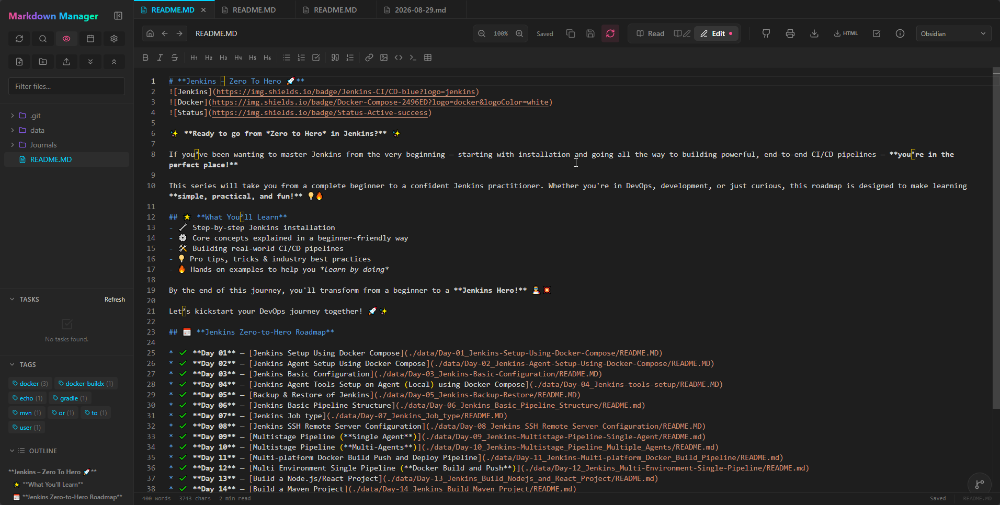
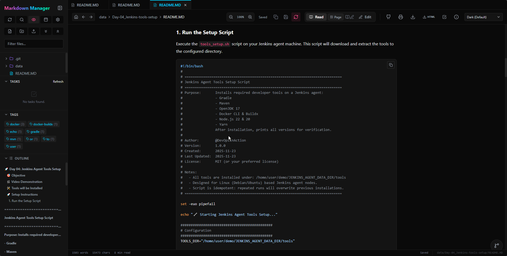
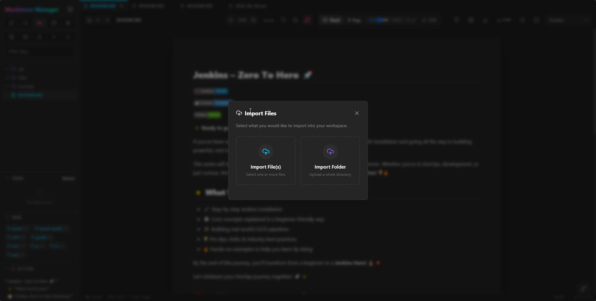

# 📚 Features Guide

Markdown Manager is packed with advanced features designed for power users, developers, and writers who want a locally-hosted, database-free knowledge base and editor.

---

## 🎨 Advanced Editing & Viewing

### 🔄 Dual Modes (Edit & Read)
* **Edit Mode**: Write raw Markdown with the powerful **Monaco Editor** (the engine behind VS Code), featuring auto-closing brackets, syntax highlighting, and code folding.
* **Read Mode**: Render your documents in a beautiful, clean, Git-style preview with responsive styling.
* **Enhanced Read Mode**: Toolbar features a Page View width slider for distraction-free reading, and one-click "Copy" buttons on all codeblocks.

*Monaco Editor with the Obsidian Theme active*

### 🛠️ Monaco Editor Toolbar
* Rich toolbar at the top of the editor for quick markdown styling: bold, italic, strikethrough, headers (H1-H6), codeblocks, quotes, lists, links, and image uploads.

*The formatting toolbar at the top of the Markdown Editor*

### 📸 Clipboard Image Paste
* Intercepts native `Ctrl+V` commands inside the editor to instantly upload images to your `assets/` directory and insert the Markdown image tag automatically.

### ⌨️ Vim Keybindings
* Built-in, toggleable Vim mode in the Monaco editor for power users who prefer keyboard-only navigation.

### 🧮 Math & LaTeX Support
* Native KaTeX integration to write and render inline math expressions using `$math$` and block equations using `$$math$$`.

### 📂 Rich Media Viewing
* Directly view images (`.png`, `.jpg`, etc.) and `.pdf` documents within the workspace tab interface.

### ⚡ Slash Commands (`/`)
* Type `/` within the editor to trigger a contextual menu and quickly insert complex structures: tables, codeblocks, LaTeX blocks, mermaid diagrams, quotes, and task checklists.

---

## 🧠 Organization & Intelligence

### 🕸️ Interactive Graph View
* Visualize your entire knowledge base as a force-directed network graph. See how your notes link together through wikilinks and discover hidden connections.

### 🏷️ Tags & Backlinks Sidebar
* **Tags**: Sidebar automatically scans and aggregates all `#tags` across your notes.
* **Backlinks (Linked Mentions)**: Appears at the bottom of notes, showing which other notes in your workspace link back to the current one.

### 🔗 Wikilinks
* Use Obsidian-style `[[Note Name]]` wikilinks for fast, easy inter-note linking.

### 📋 Global Task Manager
* Aggregates all markdown tasks (`- [ ]` and `- [x]`) from all files in your workspace into one centralized location.
* **Tasks Sidebar**: View upcoming tasks at a glance.
* **Task Dashboard**: A Kanban-style draggable board allowing you to drag tasks from "To Do" to "Done", instantly updating the source Markdown files.

*The interactive Kanban-style task dashboard*

---

## 🚀 Productivity & Workflow

### 🗂️ Advanced File Management
* Contextual sidebar menus, beautiful modals for creating, renaming, deleting, and downloading files and folders.
* Hover shortcuts in the sidebar to create files or folders inside directories immediately.

### 📅 Daily Notes & Templating
* Instantly create daily journal entries. Configure a templates folder (e.g., `Templates/Daily.md`) to automatically scaffold newly created daily notes.

*A structured daily notes document rendered in Read Mode*

### 📑 Properties Panel
* Automatically parses YAML frontmatter (`---`) at the top of your markdown files and renders them as a clean, interactive metadata form editor.

### 🗂️ Multi-File Tabs
* Open and edit multiple notes concurrently in a tabbed workspace.

### 🔍 Command Palette
* Use `Ctrl+P` (or `Cmd+P`) to trigger a global search overlay, allowing you to search and jump between files instantly.

### 📋 Document Outline (TOC)
* A dedicated sidebar panel displaying a dynamically generated, clickable Table of Contents for the active note.

*The document outline sidebar for quick navigation*

### 📥 Drag & Drop Import
* A dedicated modal to import multiple files and folders from your computer directly into your workspace.

*The drag-and-drop file/folder import dialog*

---

## 🎨 Customization & Export

### 🎭 10+ Pro Themes
* Customize your reading and editing experience with high-quality themes: Light, Dark, Obsidian, Dracula, Nord, Monokai, GitHub Dark, Solarized, Gruvbox, and One Dark.

*Quick theme switcher dropdown in the toolbar*

### 💻 Custom CSS Snippets
* Inject custom CSS variables and custom styles globally via the Settings panel to completely customize the UI.

### 💾 HTML Export
* Single-click export of any rendered Markdown note into a standalone, styled HTML file.

---

## ⚙️ System & Infrastructure

### 🐙 Native Git Integration
* Floating version control panel that lets you view file history, view diffs, and commit changes directly from the web interface.

### 💾 Filesystem-Driven (Zero Database)
* Markdown Manager runs directly on a mounted local directory. No database, completely private, and highly portable.

### 🛡️ Safe & Secure
* Built-in path traversal protection to ensure security for local files.
